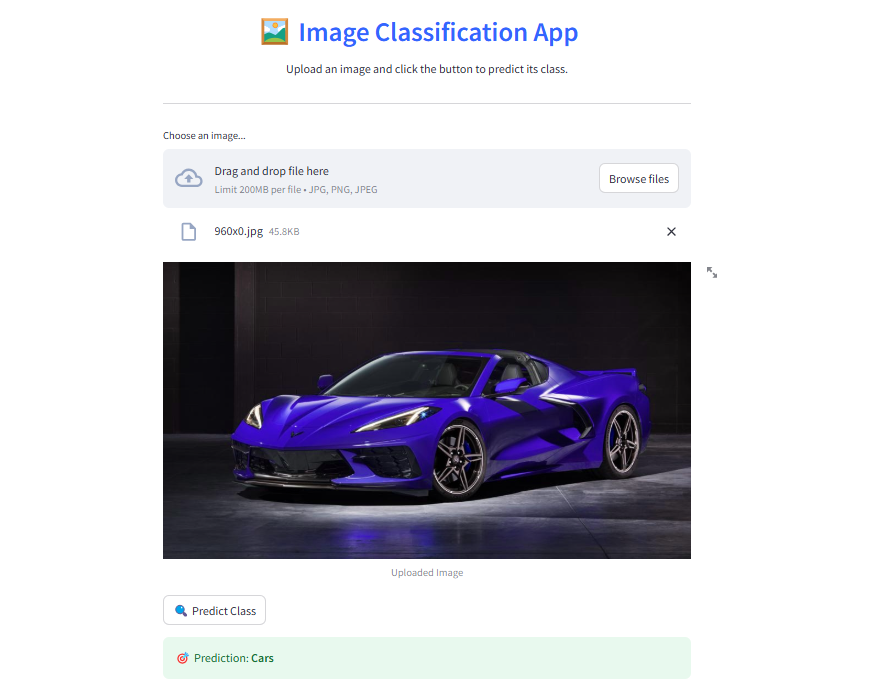

# **Image Classification using Conventional Machine Learning**  

This project explores **image classification** using conventional machine learning techniques, with a focus on **feature extraction** and **model comparison**.  

## **Streamlit Interface**  

  

## **Workflow**  

1. **Load and visualize the dataset:**  
   - Preprocess grayscale images by resizing and flattening them for model training.  

2. **Train Logistic Regression on raw pixel values:**  
   - Fit a simple logistic regression model to establish a baseline performance.  

3. **Feature Engineering with HOG (Histogram of Oriented Gradients):**  
   - Extract HOG features to enhance classification performance.  

4. **Train Logistic Regression on HOG features:**  
   - Compare the model’s performance before and after feature extraction.  

5. **Train an SVM classifier:**  
   - Experiment with **Support Vector Machines (SVM)** to evaluate its performance against Logistic Regression.  

---

## **Model Comparison Table**  

| **Model**                                  | **Feature Extractor (HOG)** | **Training Accuracy (%)** | **Test Accuracy (%)** |
|--------------------------------------------|----------------------------|--------------------------|-----------------------|
| Logistic Regression (Raw Data) - Run 1    | ❌ No                      | 100.00                   | 79.80                 |
| Logistic Regression (HOG Features) - Run 1 | ✅ Yes                     | 100.00                   | 96.97                 |
| Logistic Regression (Raw Data) - Run 2    | ❌ No                      | 97.34                    | 92.93                 |
| Logistic Regression (HOG Features) - Run 2 | ✅ Yes                     | 99.87                    | 97.47                 |

---

## **Observations**  

1. **Feature extraction using HOG significantly improves test accuracy.**  
   - Without HOG, test accuracy is lower (**79.80% and 92.93%**).  
   - With HOG, test accuracy improves to **96.97% and 97.47%**.  

2. **Models trained on raw pixel values tend to overfit.**  
   - Logistic Regression trained on raw images reaches **100% and 97.34%** training accuracy.  
   - However, it fails to generalize well, leading to lower test accuracy.  

---

### **How to Run the Project**  

1. Train the models by running all the cells in the `code.ipynb`  

2. Launch the Streamlit app:  
   ```bash
   streamlit run app.py
   ```

This will open a web interface for image classification using the trained models.  

---