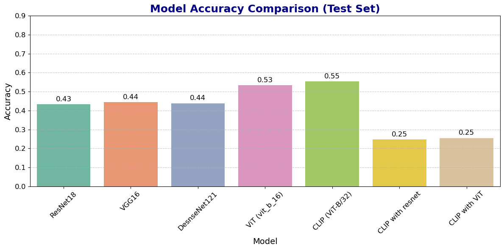
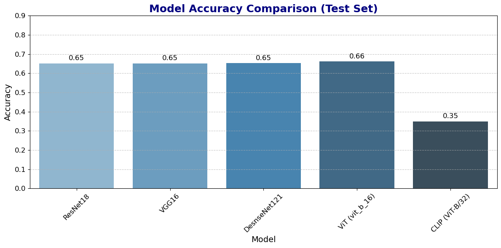
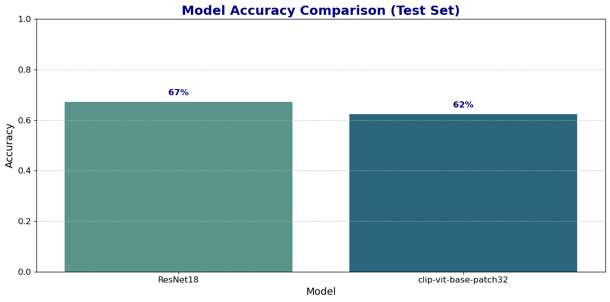
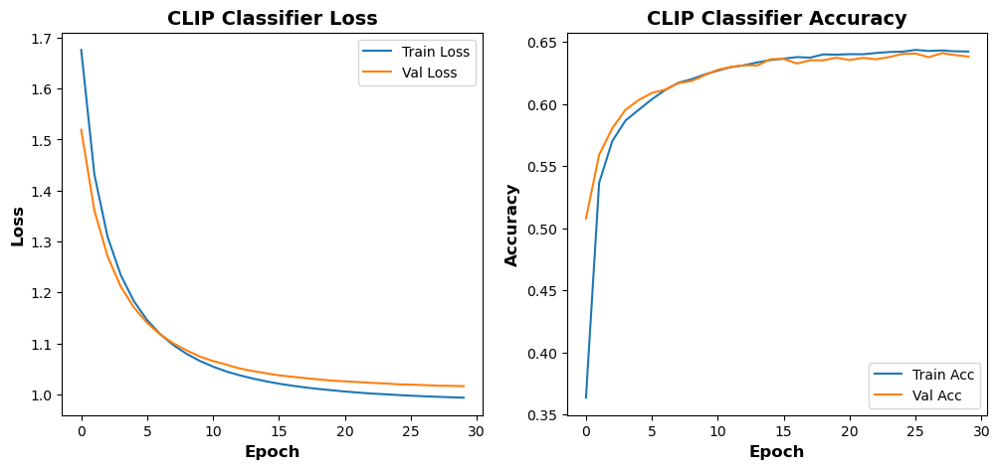
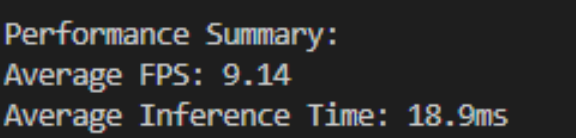
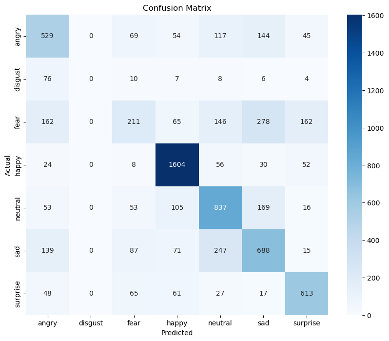

# Facial Emotion Recognition

## Abstract

This study focuses on implementing and evaluating several deep learning models for facial emotion recognition (FER) using the 
[FER-2013 dataset](https://www.kaggle.com/datasets/msambare/fer2013). 
The primary objective is to determine the approach for selecting the most suitable model for this task. We conducted extensive experiments by training and comparing 
the performance of CNN-based models, Vision Transformers, and the CLIP model to classify human emotions from facial expressions. The study addresses the challenges 
posed by the dataset's imbalance classes and low resolution, and explores fine-tuning techniques to enhance model performance. The results show that the 
`openai/clip-vit-base-patch32` model achieves a balance between accuracy and inference speed, making it suitable for real-time emotion recognition applications.

## Project Overview

Facial Emotion Recognition (FER) enables machines to interpret human emotions by analyzing facial expressions. This study aims to train models for accurate facial emotion 
recognition using the [FER-2013 dataset](https://www.kaggle.com/datasets/msambare/fer2013). The dataset presents challenges due to its imbalance classes and small image 
size (48x48 pixels). The objective is to identify the pre-trained model that performs best for this task.

## Models Explored

We explore several models, including:
* **CNN-based models**: `ResNet18`, `VGG16` and `DenseNet121`
* **Vision Transformers (ViT) model**: `vit_b_16`
* **CLIP model**: `ViT-B/32` (`openai/clip-vit-base-patch32`)

## Experimentation Process

### Step 1: Feature Extraction

In the [first](./experiments/fer-experiments_models_as_featureExtractor.ipynb) step, all pre-trained models are used as `fixed feature extractors`. 
The pre-trained layers are frozen, and only the fully connected layers are trained for **20 epochs**. The models are evaluated and their performances are compared.


### Step 2: Fine-Tuning

In the [second](./experiments/fer-experiments_fineTune_entireModel.ipynb) step, the entire network of each model is `fine-tuned` for **5 epochs**. 
Considering the dataset's reasonable size, we allowed the models to fully adapt to the specific task.
The models were evaluated on the test dataset and their performances were compared with each other.



## Results

After fine-tuning, when the models are evaluated on test data, all the models performed well as compared, when they are just used as feature extractors. 
We selected two models—`ResNet18` and `openai/clip-vit-base-patch32`—for further experimentation and hyperparameter tuning.

### Selected Hyperparameters:

* **ResNet18**:
	* Optimizer: Adam
	* Batch Size: 64
	* Learning Rate: 1e-4
	* Weight Decay: 1e-4
	* Augmentation: `RandomHorizontalFlip()`
   
* **openai/clip-vit-base-patch32**:
	* Optimizer: Adam
	* Batch Size: 64
	* Learning Rate: 1e-3
	* Weight Decay: 1e-4
	* Augmentation: `RandomHorizontalFlip()`
   
Both models were [trained](./training/training_notebook.ipynb) for **30 epochs** on an **NVIDIA GeForce GTX 1070 Ti GPU**. Their performance can be seen below:




## Overfitting Challenges

While ResNet18 achieved higher accuracy, its learning curve indicated overfitting. We experimented with various augmentation techniques, regularization, weight decay, 
and dropout layers, but the results were suboptimal.
On the other hand, the `openai/clip-vit-base-patch32` model achieved a test accuracy of `62.44%`. Although its accuracy is lower than that of ResNet18, but its 
training curves—accuracy and loss—show a more balanced learning process. For practical purposes, we selected this model and saved its weights.



## Inference Performance

The seleceted model (`openai/clip-vit-base-patch32`) achieves a functional real-time performance with the following metrics:
* **Average FPS:** 9
* **Average Inference Time:** 18.9ms
While the frame rate (`7-10 FPS`) on an `Intel Core i7-8650U CPU` is below traditional real-time thresholds (15-20 FPS), it is sufficient for effective emotion recognition, as facial expressions change slowly.
<p align="center">
    
</p>

## Dataset Overview

The FER-2013 dataset consists of 48x48 pixel grayscale images of faces. Each face is categorized into one of seven emotion categories:
* **Emotions:** Angry (0), Disgust (1), Fear (2), Happy (3), Sad (4), Surprise (5), Neutral (6)

### Dataset Structure:

The dataset contains:
* **Training Set**: 28,709 examples
* **Test Set**: 35889 examples
The dataset is organized as follows:

```sh
data
 |- train
	|- angry
	|- disgust
	|- fear
	|- happy
	|- neutral
	|- sad
	|- surprise
 |- test
	|- angry
	|- disgust
	|- fear
	|- happy
	|- neutral
	|- sad
	|- surprise
```

### Train-Validation Split
Since the dataset does not provide a predefined validation set, we split the training set into training and validation subsets:
* **Training Set**: ~69.9%
* **Validation Set**: ~10.0%
* **Test Set**: ~20.0%
This split allows us to monitor the model’s performance during training.

## Confusion Matrix:
Below is the confusion matrix for the `openai/clip-vit-base-patch32` model on the test dataset:



## Conclusion

Through extensive experiments, we have identified the `openai/clip-vit-base-patch32` model as an effective solution for facial emotion recognition, achieving a balance 
between accuracy and inference speed. This project highlights the potential of Vision Transformers in real-time emotion analysis applications. Additionally, 
we have developed a [web application](./main.py) using Streamlit, to experience real-time emotion recognition from a live webcam feed.


---
